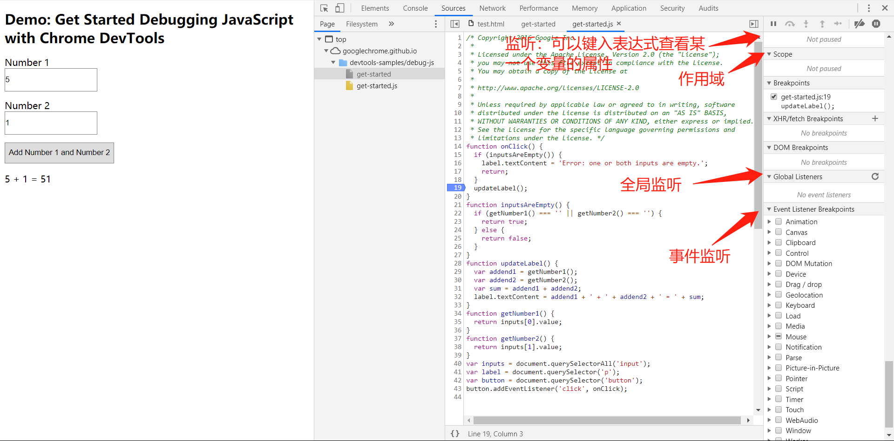

[TOC]

# google chorme 开发者工具

## Console

### **通过URL过滤消息**

键入`url:`后跟一个URL，以仅查看来自该URL的消息。键入`url:`DevTools 后，将显示所有相关的URL。

### **重新运行历史记录中的表达式**

按下该Up Arrow键可循环显示先前在控制台中运行的JavaScript表达式的历史记录。按Enter再次运行该表达式。

### **$ _**

相当于matlab中的ans

### **Live Expression**

如果您发现自己在控制台中反复键入相同的JavaScript表达式，则可能会发现创建**Live Expression**更容易。使用**实时表达式，**您只需键入一次表达式，然后将其固定到控制台的顶部。表达式的值几乎实时更新。

### **table()**

表格展示 当传入的参数是表格数据的时候 可以表格展示

## Source

通过工作区，您可以将在Devtools中所做的更改保存到计算机上同一文件的本地副本。例如，假设：

- 您在桌面上拥有网站的源代码。
- 您正在从源代码目录中运行本地Web服务器，以便可以从访问该站点`localhost:8080`。
- 您已`localhost:8080`在Google Chrome浏览器中打开文件，并正在使用DevTools更改网站的CSS。

启用工作空间后，您在DevTools中进行的CSS更改将保存到桌面上的源代码中。

工作区

## Network

### **waterfall**

**浏览器根据HTML中外连资源出现的顺序，依次放入队列（队列），然后根据优先级确定向服务器获取资源的顺序。同优先级的资源根据HTML中出现的先后顺序来向服务器获取资源。**

**瀑布中各项内容的含义：**
排队：  出现下面的情况时，浏览器会把当前请求放入队列中进行排队
有更高优先级的请求时
和目标服务器已经建立了6个TCP链接（最多6个，适用于HTTP / 1.0和HTTP / 1.1）     
浏览器正在硬盘缓存上简单的分配空间                 
停滞：  请求会因为上面的任一个原因而阻塞
DNS查询：浏览器正在解析IP地址，在浏览器和服务器进行通信之前，必须经过DNS查询，将域名转换成IP地址。在这个阶段，你可以处理的东西很少。但幸运的是，并非所有的请求都需要经过这一阶段
代理协商：浏览器正在与代理服务器协商请求
要求已发送：请求已发送
ServiceWorker准备：浏览器正在启动服务器
请求ServiceWorker：请求正在被发送到服务器
等待（TTFB）：浏览器等待响应第一个字节到达的时间。包含来回的延迟时间和服务器准备响应的时间
内容下载：浏览器正在接收响应信息
接收推送：浏览器正在通过HTTP / 2服务器推送接收此响应的数据
阅读推。：浏览器正在读取以前接收到的本地数据
初始连接：在浏览器发送请求之前，必须建立TCP连接。这个过程仅仅发生在瀑布图中的开头几行，否则这就是个性能问题
SSL / TLS协商：如果你的页面是通过SSL / TLS这类安全协议加载资源，这段时间就是浏览器建立安全连接的过程。目前谷歌将HTTPS作为其搜索排名因素之一，SSL / TLS协商的使用变得越来越普遍了
时间到第一个字节（TTFB）： TTFB是浏览器请求发送到服务器的时间+服务器处理请求时间+响应报文的第一字节到达浏览器的时间。我们用这个指标来判断你的网络服务器是否性能不够，或者说你是否需要使用CDN
下载：这是浏览器用来下载资源所用的时间。这段时间越长，说明资源越大。理想情况下，你可以通过控制资源的大小来控制这段时间的长度

**瀑布中的颜色：**
显然，瀑中有好几种颜色：浅灰，深灰，橙色，绿色，蓝色结合上面的解释，大概知道这些颜色代表的含义了：

浅灰：查询中
深灰：停滞，代理转发，请求发送
橙色：初始连接
绿色：等待中
蓝色：内容下载
除了这些横向的柱状图外，还有一条纵向的紫色的线

`DOMContentLoaded`事件在**Overview**上用一条**蓝色**竖线标记，并且在**Summary**以**蓝色**文字显示确切的时间。

`load`事件同样会在**Overview**和**Requests Table**上用一条**红色**竖线标记，在**Summary**也会以**红色**文字显示确切的时间。

紫线是开始通过脚本加载资源的一个临界线，紫线之前，都是通过HTML文件进行加载的资源，要么是链接的SRC，要么是脚本的SRC;而紫线之后，就成了通过执行HTML文件加载进来的js script，进行加载资源的操作。这条线对于前端工程师至关重要，能够帮助他们进行前端性能优化分析。

**如何根据瀑布图进行性能优化**
瀑布图提供了三个直观的东西来帮助我们进行前端性能优化

首先，减少所有资源的加载时间。亦即减小瀑布图产品的宽度。瀑布图越窄，网站的访问速度越快
其次，减少请求数量也就是降低瀑布图的高度。瀑布图越矮越好
最后，通过优化资源请求顺序来加快渲染时间。从图上看，就是将绿色的“开始渲染”线向左移。这条线向左移动的越远越好

### **阻止请求**

页面的某些资源不可用时，页面的外观和行为如何？它会完全失败，还是仍然有些功能？阻止请求以找出：

操作

+ ctrl+shift+p 调出命令菜单
+ 选择第一个
+ 添加某个请求 refresh

## Snippets

如果发现自己在[**控制台中**](https://developers.google.cn/web/tools/chrome-devtools/console/)重复运行相同的代码，请考虑将代码另存为代码段。代码段是您在“ [**源”**面板](https://developers.google.cn/web/tools/chrome-devtools/sources)中编写的脚本 。他们可以访问页面的JavaScript上下文，您可以在任何页面上运行它们。片段是[书签](https://en.wikipedia.org/wiki/Bookmarklet)的替代方法。Firefox DevTools具有类似于片段的功能，称为[Scratchpad](https://developer.mozilla.org/en-US/docs/Tools/Scratchpad)。

### 操作

+ 打开snippets界面
+ 光标在devtool内部
+ ctrl+shift+p 开始输入`Snippets`，选择**显示代码片段**，然后按Enter运行命令。